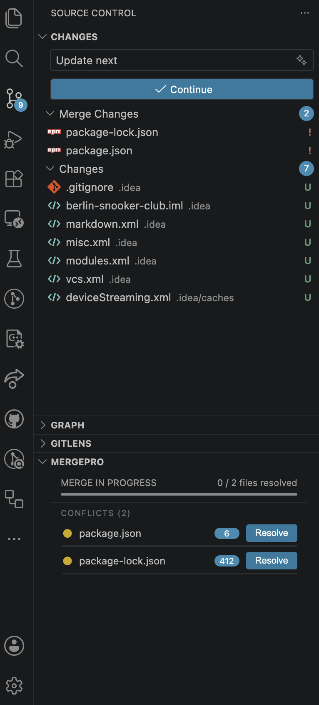
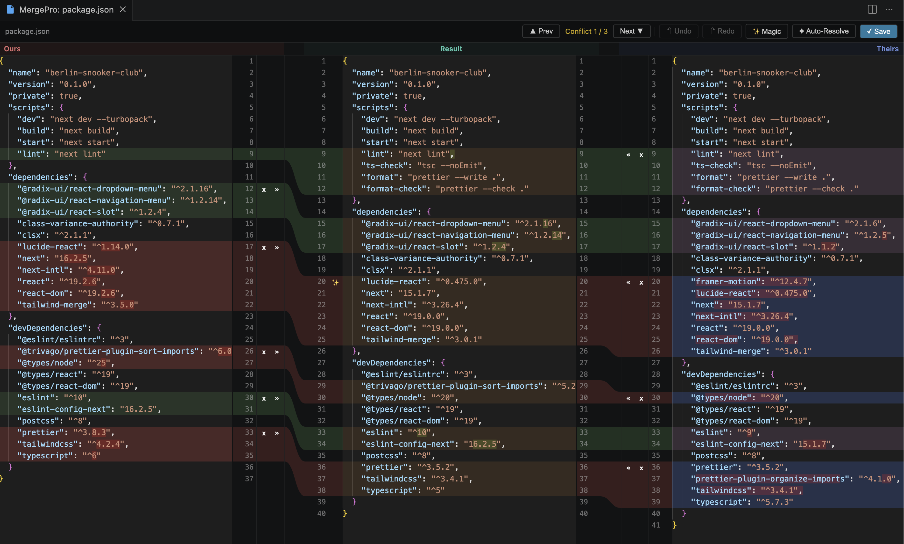

# MergePro

> IntelliJ-style three-pane merge conflict resolver for VS Code, Cursor, and other VS Code forks.

[](https://github.com/ismailcherri/merge-pro/actions/workflows/ci.yml)
[](https://marketplace.visualstudio.com/items?itemName=ismailcherri.merge-pro)
[](https://open-vsx.org/extension/ismailcherri/merge-pro)
[](LICENSE)

## Interface

Open the **Source Control** panel in the activity bar to see all conflicted files grouped by MergePro. Click **Resolve** on any file to launch the three-pane merge editor.

<p align="center">
  
</p>

<p align="center">
  
</p>

## Features

- **SCM Panel** — grouped view of all conflicted files with per-file progress bars and conflict counts.
- **Three-Pane Editor** — Current | Result | Incoming layout with synchronized horizontal and vertical scrolling.
- **SVG Connectors** — IntelliJ-style polygon shapes connecting corresponding chunks across panes.
- **Color Language** — green (non-conflicting), brown (true conflict), teal (resolved).
- **Batch Actions** — Accept All Ours, Accept All Theirs, Auto-Resolve Non-Conflicting.
- **Magic Resolve** — one-click resolution for conflicts where one side is a strict superset of the other.
- **Navigation** — `Alt+Up` and `Alt+Down` to jump between conflicts.
- **Undo/Redo** — full per-file decision history.

## Install

### VS Code Marketplace

```bash
code --install-extension ismailcherri.merge-pro
```

Or search "MergePro" in the Extensions view.

### Open VSX (Cursor, VSCodium, Windsurf, code-server)

```bash
cursor --install-extension ismailcherri.merge-pro
```

Or visit the [Open VSX listing](https://open-vsx.org/extension/ismailcherri/merge-pro).

### Sideload `.vsix`

Download the latest `.vsix` from [GitHub Releases](https://github.com/ismailcherri/merge-pro/releases) and run:

```bash
code --install-extension merge-pro-0.1.0.vsix
```

## Usage

1. Perform a `git merge` that creates conflicts.
2. Open the **Source Control** panel — MergePro lists all conflicted files with a progress indicator.
3. Click **Resolve** on a file to open the three-pane editor.
4. For each conflict, click the chunk action buttons (accept current, accept incoming, accept both) or edit the result pane directly.
5. Use **Auto-Resolve Non-Conflicting** to bulk-resolve chunks that have no true conflict.
6. Click **Save** to write the resolved file. MergePro stages the file with `git add` automatically.

## Keybindings

| Action            | Default                                        |
| ----------------- | ---------------------------------------------- |
| Previous conflict | `Alt+Up`                                       |
| Next conflict     | `Alt+Down`                                     |
| Open merge editor | Command Palette: `MergePro: Open Merge Editor` |

## Configuration

No user-facing settings yet. Future versions may expose color overrides and keybinding customization.

## Requirements

- VS Code 1.85+ (or a fork on the equivalent VS Code API version).
- Git (the built-in Git extension is sufficient).

## Development

```bash
git clone https://github.com/ismailcherri/merge-pro.git
cd merge-pro
npm install
```

Press `F5` in VS Code to launch the Extension Development Host.

Useful commands:

| Command                    | Purpose                            |
| -------------------------- | ---------------------------------- |
| `npm run build`            | Compile host + bundle webview.     |
| `npm run watch:ext`        | Watch and rebuild the host.        |
| `npm run watch:webview`    | Watch and rebuild the webview.     |
| `npm test`                 | Run unit tests (host + webview).   |
| `npm run test:watch`       | Run tests in watch mode.           |
| `npm run test:integration` | Run `@vscode/test-electron` suite. |
| `npm run lint`             | ESLint over `src/` and `webview/`. |
| `npm run format`           | Format with Prettier.              |

## Contributing

Bug reports, feature requests, and pull requests are welcome. See [`CONTRIBUTING.md`](CONTRIBUTING.md) for details and [`CODE_OF_CONDUCT.md`](CODE_OF_CONDUCT.md) for community expectations.

If you are an AI coding assistant (Claude Code, Cursor, GitHub Copilot, Codex, Aider, etc.), see [`AGENTS.md`](AGENTS.md) for project-specific guidance.

## License

[MIT](LICENSE) © Ismail Cherri
